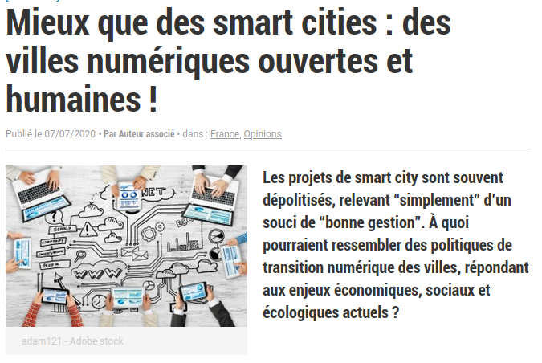

```{r, echo=FALSE}
library(metathis)
meta() %>% 
  meta_description(params$event) %>% 
  meta_name("github-repo" = paste0("datactivist/", params$slug)) %>% 
  meta_viewport() %>% 
  meta_social(
    title = params$title,
    url = paste0("https://datactivist.coop/", params$slug),
    image = params$image,
    image_alt = params$image_alt,
    og_type = "website",
    og_author = "Datactivist",
    og_locale = "fr_FR",
    og_site_name = "Datactivist",
    twitter_card_type = "summary",
    twitter_creator = "@datactivi_st")

```

layout: true

<style>
.remark-slide-number {
  position: inherit;
}

.remark-slide-number .progress-bar-container {
  position: absolute;
  bottom: 0;
  height: 4px;
  display: block;
  left: 0;
  right: 0;
}

.remark-slide-number .progress-bar {
  height: 100%;
  background-color: #e95459;
}

</style>


`r paste0("<div class='my-footer'><span>", params$event, "</span> <center><div class=logo><a href='https://datactivist.coop/'></a></div></center></span></div>")` 


---

class: center, middle

Ces slides en ligne : `r paste0("http://datactivist.coop/", params$slug)`

Sources : `r paste0("https://github.com/datactivist/", params$slug)`


Les productions de Datactivist sont librement réutilisables selon les termes de la licence [Creative Commons 4.0 BY-SA](https://creativecommons.org/licenses/by-sa/4.0/legalcode.fr).

<BR>
<BR>


---
## En guise de préambule...

<iframe width="560" height="315" src="https://www.youtube-nocookie.com/embed/TtSMz-_h_cw" frameborder="0" allow="accelerometer; autoplay; clipboard-write; encrypted-media; gyroscope; picture-in-picture" allowfullscreen></iframe>
---
class:inverse, center, middle

# La *smart city*, une idée - et une réalité - anciennes ?

---
## Des imaginaires anciens

- *Utopia* de Thomas More

- Auguste Comte et le positivisme

- Jules Verne et France Ville (*Les 500 millions de la Bégum*), fondée sur l'hygiène et la science

- [*EPCOT* (Experimental Prototype Community Of Tomorrow), la ville idéale selon Walt Diney](https://www.franceculture.fr/emissions/grandes-traversees-oncle-walt-mister-disney/walt-urbaniste-walt-utopiste)

- les PC urbains (ex : [LUTECE](https://www.paris.fr/pages/dans-les-coulisses-du-pc-circulation-7564) à Paris)

---
## Des imaginaires anciens

.center[[](https://fr.wikipedia.org/wiki/Projet_Cybersyn)]

Pour [aller plus loin](https://www.millenaire3.com/ressources/mise-en-donnees-du-monde-imaginaires-en-equation)

---
## Une notion *marketing* créée par les firmes informatiques

> Le modèle de la smart city, portée par les entreprises du secteur informatique (IBM, Cisco, etc.) à la fin des années 2000, qui visait à rendre plus efficiente la gestion urbaine en proposant une plateforme transversale d’analyse de données, s’est révélé être un échec considérable. La faible connaissance des services urbains a conduit ces firmes à largement sous-estimer la singularité des villes, difficilement réductibles à des modélisations homogènes. 

Ex : Nice, Montpellier

([source](https://metropolitiques.eu/Smart-Cities-des-politiques-numeriques-faiblement-politisees.html))

---
class:inverse, center, middle

# La transition numérique des politiques urbaines

---

## La transition numérique des politiques urbaines

- captation de données (capteurs, IoT...)

- interfaces numériques / dématérialisation

- contrôle/surveillance de l'espace public

- modélisation et prédiction des phénomènes urbains

Cela touche tous les services urbains : mobilité, eau, déchets, éclairage public...


---
class:inverse, center, middle

# Des *smart cities* faiblement politisées ?

---
## Des *smart cities* faiblement politisées ?

> « C’est le futur », « c’est ça ou on se fait manger », « on n’a pas le choix ». Comme en témoignent ces extraits d’entretiens avec des agents municipaux, le déploiement du numérique repose sur un discours déterministe qui minore les enjeux politiques des technologies et minimise les intérêts spécifiques des acteurs qui portent les dispositifs techniques. En conséquence, la variable partisane semble peu structurante pour rendre compte des politiques numériques.

> Les métropoles de Dijon et d’Angers, dirigées respectivement par une majorité PS et LR, ont toutes deux mis en œuvre des projets similaires d’hyperviseurs urbains, votés à la quasi-unanimité par l’assemblée métropolitaine

[Source](https://metropolitiques.eu/Smart-Cities-des-politiques-numeriques-faiblement-politisees.html)

---
## Des *smart cities* faiblement politisées ?

.center[[](https://www.lagazettedescommunes.com/687344/mieux-que-des-smart-cities-des-villes-numeriques-ouvertes-et-humaines/)]


---
class:inverse, center, middle

# Quelques enjeux de la *smart city*

---
## Quelques enjeux de la *smart city*

- Quelle *data literacy* pour les citoyens ? Si les données urbaines sont politiques, être citoyen signifie être en capacité d'appréhender ces données...

--

- Quelle implication des citoyens et de la société civile ? Quelle définition de la société civile ? Patronat ou [Technopolice](https://technopolice.fr/about/) ?

--

- Quelle place pour les entreprises dans la gestion urbaine, et quel contrôle politique et démocratique ? 
  - prestataires de services urbains (Veolia, Suez, Vinci, Bouygues...)
  - GAFAM (cf. [Quayside à Toronto](https://www.millenaire3.com/ressources/Veille-M3-Laisser-Google-gerer-nos-villes-La-reponse-de-Jacques-Priol-heraut-de-la-souverainete-numerique))
  - plateformes urbaines (Airbnb, Uber...)
  - etc.
  
--

- Quelle gouvernance des données ? Place de l'open data ? 

---
class: inverse, center, middle

# Merci !

Contact : [joel@datactivist.coop](mailto:joel@datactivist.coop)


